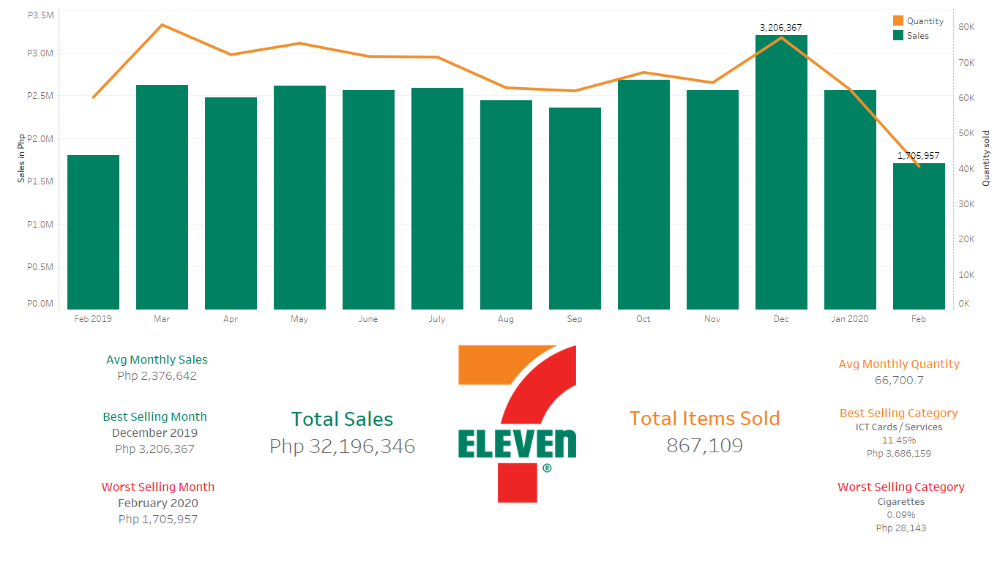

## Thank Heaven for 7-Eleven: A Sales Analysis of a 7-Eleven Store in Muntinlupa City

[Jason A. Dolorso](https://www.linkedin.com/in/jasondolorso/)  
Asian Institute of Management

### Abstract

Need refreshments after a banging party? Craving for some chips for your late-night Netflix marathon? Maybe a coffee fix for your whole nighter project? Whatever it is, the chances are there's a nearby 7-Eleven store and that got exactly what you need.

7-Eleven is Japanese-American international chain of convenience stores, headquartered in Dallas, Texas.

In late 70s to early 80s, 7-Eleven are only seen on movies and television. Until on October 26, 1982, Philippine Seven Corp. (PSC) acquired the license agreement to use the 7-Eleven Convenience Store system in the entire Philippines from Southland Corporation of Dallas, Texas.

They now have 68,236 stores world wide and have 2,600 branches here in the Philippines. Ask someone from anywhere in the world what the 7-Eleven is and you may probably get an answer.

For this post, we'll try to see things from the inside of a typical 7-Eleven branch by analyzing the data of a store in Muntinlupa City. Specifically, the sales data for a 13-month period from February 2019 to February 2020.

---

*Full text article and source codes can be provided upon request*.

