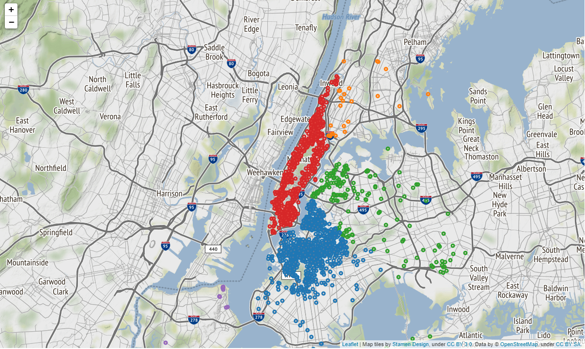

## The City that Never Sleeps: Airbnb™ Recommender System for New York City

[Jason Dolorso](https://www.linkedin.com/in/jasondolorso/)  
Asian Institute of Management

### Executive Summary

Tourism is said to be one of the drivers of New York City's economic prosperity. In 2019 alone, 66.6 million visitors to the city spent over 46.4 billion USD on hotels, restaurants and other establishments across the citie's five boroughs. One of the city's catalysts in this much success is the rise of Airbnb. Airbnb is the top online platform for acommdations around the world for both tourists and travellers. According to the statistics of iProperty Management, New York City is the 4th most popular city for booking experience with more than 40,000 unique listings. With this much options for travellers, this study aims to determine which Airbnb listing in New York City can be recommended to a user.

Data was obtained from the Inside Airbnb dataset and is stored into an SQL database. Since there are no available numerical rating per user, Natural Language Processing was used to extract the polarity of each user's text reviews and used it to develop a user-based collaborative filtering.

With the combination of Sentiment Analysis and User-based Collaborative Filtering, the recommender system can provide suggestions to a user based on his/her previous reviews, and even taking into account preferences such as room type, borough (location), and price range.

---

*Full text article and source codes can be provided upon request*.

