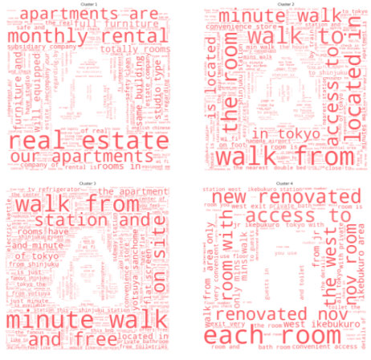

## Land of the Rising Sun: Uncovering Clusters from Airbnb listings in Tokyo, Japan

[Jason Dolorso](https://www.linkedin.com/in/jasondolorso/), 
[Chester Romel S. Patalud](https://www.linkedin.com/in/chesterromelpatalud),  
Asian Institute of Management

### Executive Summary

Airbnb was one of the top online platform for accomodations around the world for both tourists and travellers. According to the statistics of iProperty Management, Tokyo, Japan is the most popular city for booking experience. Our study aims to determine themes that can be extracted from the Airbnb listing in Tokyo, Japan using unsupervised clustering -- and at the same time, see what made Airbnb so successful in the city.

Data was obtained from jojie public Inside Airbnb dataset and stored in an SQLite database. Term Frequency–Inverse Document Frequency (TF-IDF) for feature extraction and Dimensionality Reduction (Latent Semantic Analysis) were performed to the corpus.

With this, we were able to identify 4 clusters on Tokyo's Airbnb listing summaries: (1) Facility type, (2) Accesibility, (3) Proximity, and (4) Room Quality. These clusters can be considered to what the hosts are highlighting about their accomodations. This information would be helpful to tourists, local and foreign tourism bodies, and business owners in pursuing different strategies and decisions with regards to travel and tourism.

---

*Full text article and source codes can be provided upon request*.

