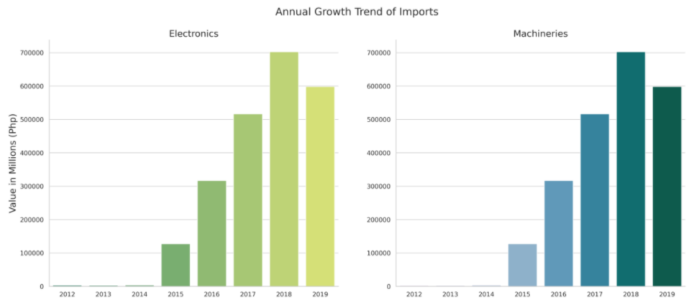

## Analysis on Customs Import Data: Manufacturing, Food, and Clothing as the Strongest Business Opportunities

[Perry Ervine O. Ang](https://www.linkedin.com/in/perryang),
[Carlo T. Antioquia](https://www.linkedin.com/in/carlo-antioquia/),
[Albertyn Nicolle S. Carpio](https://www.linkedin.com/in/albertyn-nicolle-carpio),
[Jason A. Dolorso](https://www.linkedin.com/in/jasondolorso/), 
[Chester Romel S. Patalud](https://www.linkedin.com/in/chesterromelpatalud)  
Asian Institute of Management

### Abstract

Economically speaking, there are many advantages to having one's own business. However, becoming an enrepreneur is fraught with uncertainty and risk. As such, before starting a business, one must begin first with the research to rationalize that such a business would be viable. Chief of which would be into analyzing the best industry to enter, with particular attention if there is a market for your business idea. Using the data collated from the Bureau of Customs' imports transaction records, we aim to determine if there are any useful insights from trends in the imported goods that can serve as a guide for budding entrepreneurs.

We used the top-down approach to filter out interesting industries and product categories, and then investigated the performance of imports on an annual basis, using the following metrics:

Import value (in millions PHP)
Transaction count
Average transaction size
Import volume (in millions of tonnes)
Year-on-year growth (% YoY)
Our results show a generally increasing trend in imports from 2012 to 2018, although we note a slight dip in import value in 2019. We attribute this to the relative small growth in transaction count in the same time period. Nevertheless, we find that there are sectors which have been exhibiting significant growth and these could provide pockets of opportunities for entrepreneurs.

Specifically, our findings show opportunities in the areas of Manufacturing, Food and Beverages, and Clothing and Footwear. We expound on this further in our report, including the products and services that might be worth exploring around these industries.

---

*Full text article and source codes can be provided upon request*.

