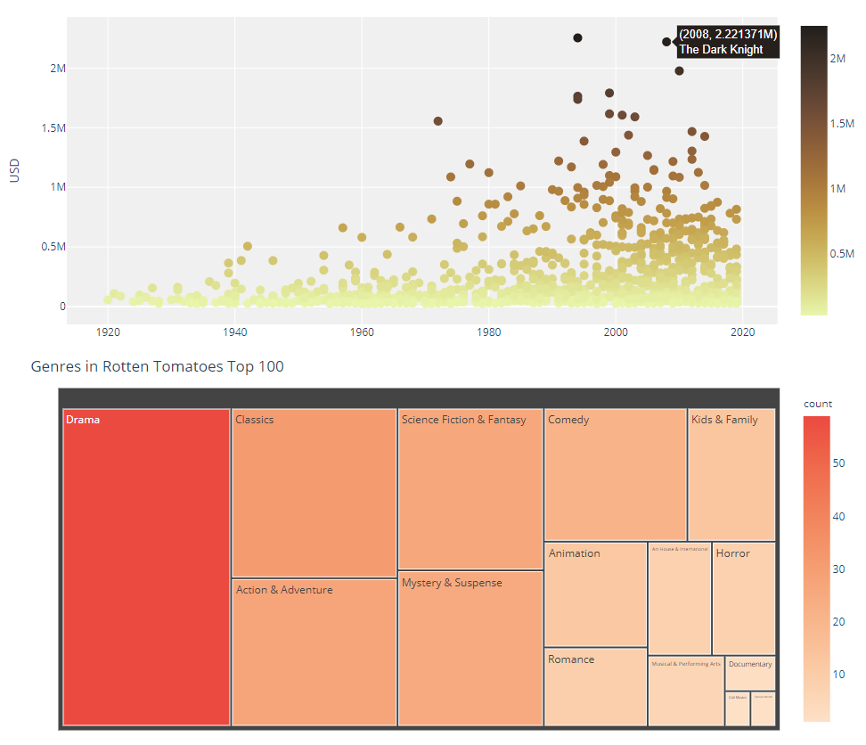

## May The Force Be With You: Analyzing the Difference in Rating System between IMDB and Rotten Tomatoes

[Jason Dolorso](https://www.linkedin.com/in/jasondolorso/),
[Chester Romel S. Patalud](https://www.linkedin.com/in/chesterromelpatalud)  
Asian Institute of Management

### Executive Summary

We are all in search for the best movies to watch. The two websites that might cross our heads for movie consultation is IMDB and Rotten Tomatoes. Our study aim to determine the differences in rating system and movie preferences of IMDB users and Rotten Tomatoes critics based on the top movies for each site. Dataset was retreived though web scraping in each of their websites.

We use both comparative and individual analysis to determine the differences and preferences. Our results show that in terms of the top movies, there is a difference in rating between the 2 websites as not all of the movies were in top of each other. Drama is the most preferred genre for both websites but differ on the next preferred ones. Rating through time also differs with each other.

In terms of individuality, it can be observed that for IMDB rating counts, newer movies receives more user ratings than older ones. Paramount and Warner brothers were the most preferred studios of Rotten Tomatoes critics.

---

*Full text article and source codes can be provided upon request*.

