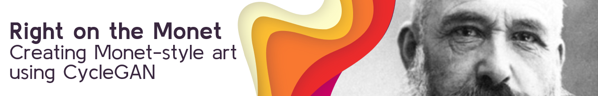
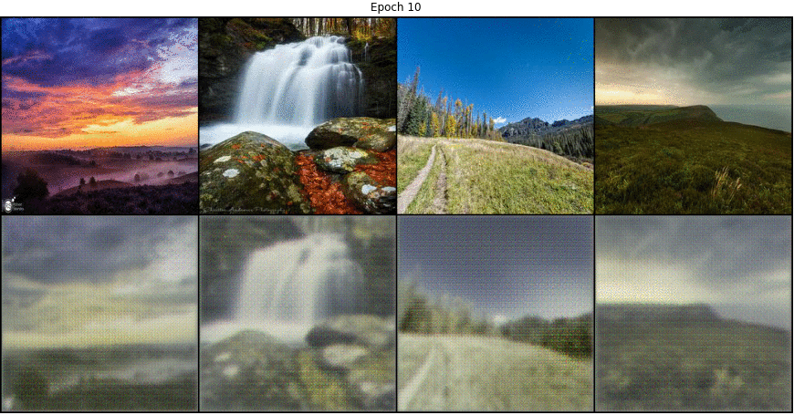

## Right on the Monet: Creating Monet-style Art using CycleGAN

[Jason Dolorso](https://www.linkedin.com/in/jasondolorso/), 
Asian Institute of Management

### Executive Summary

Generative Adversarial Networks (GANs) is one of the breakthroughs in the field of Neural Networks since it was introduced in 2014 and Image-to-Image translation is one of it's widely known use where an image is translated into another such as turning a horse into a zebra or summer landscape into a winter setting. CycleGANs, a variant of GANs solves one of the difficulties of Image-to-image translation as it eliminates the need for paired samples. This project shows how CycleGAN works and how we can apply it to turn random landscapes into a Monet-like painting. Although the Monet-fied results are satisfying according to groups of people whom the images are shown to, the validation remains the difficult part in the GAN creation process especially with an art-related application due to its subjectivity.

#### Keywords

generative Adversarial networks, cyclegan, art generation

---
*Full text article and source codes can be provided upon request*.

