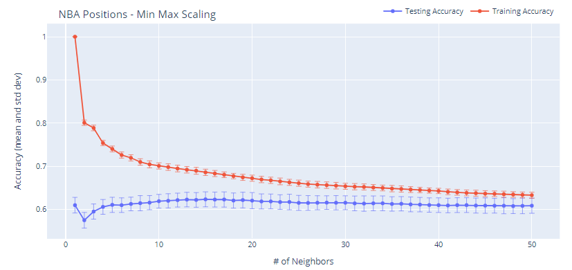

## Call of the Forest: Detection of Animal Species in Tropical Landscape

[Dennis Dominic Diego](https://www.linkedin.com/in/dennis-dominic-diego),
[Jason Dolorso](https://www.linkedin.com/in/jasondolorso/), 
[Cymon Marcaida](https://www.linkedin.com/in/cymonmarcaida/), 
[Matthew Romero](https://www.linkedin.com/in/matmatromero)  
Asian Institute of Management

### Executive Summary

From the pre-2000s big man era full of post-ups, to fast-paced offense strategies like the Suns' 7-seconds or less, and even until today's 3-point driven basketball, the game of basketball has evolved throughout the decades. And, along with it, is how each player's position is played.

In the past few years, pick-and-roll has become the cornerstone of NBA games. It is a type of offense that involves a lot of switching of defenders -- which then gave birth to positionless basketball, where each defender can switch to someone in offense regardless of position.

With today's games having an emphasis on switching and floor spacing, we want to know if we can still determine an NBA player's position by their stats using K-Nearest Neighbors (KNN) classifier.

### Key Highlights
* Players' positions can be identified based on their season average statistics.
* Accuracy improves when classifying positions as Frontcourt or Backcourt.
* Assists, defensive rebounds, and 3-pointers are the most important features.

---

*Full text article and source codes can be provided upon request*.

