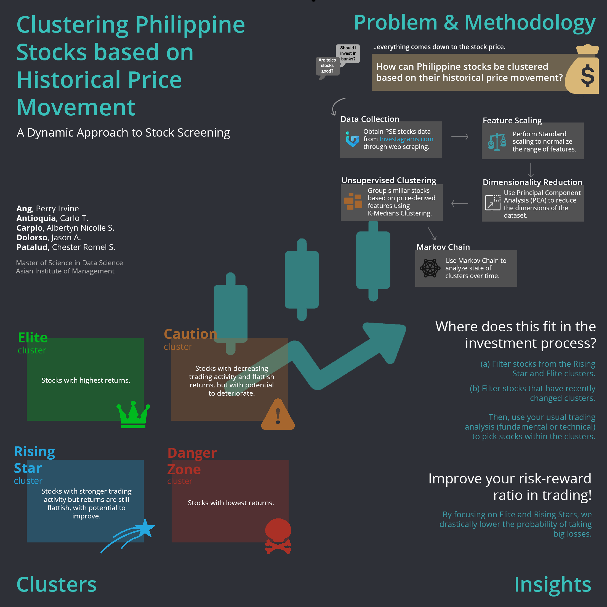

## Clustering Philippine Stocks based on Historical Price Movement: A Dynamic Approach to Stock Screening

[Perry Ervine O. Ang](https://www.linkedin.com/in/perryang),
[Carlo T. Antioquia](https://www.linkedin.com/in/carlo-antioquia/),
[Albertyn Nicolle S. Carpio](https://www.linkedin.com/in/albertyn-nicolle-carpio),
[Jason A. Dolorso](https://www.linkedin.com/in/jasondolorso/), 
[Chester Romel S. Patalud](https://www.linkedin.com/in/chesterromelpatalud)  
Asian Institute of Management

### Executive Summary

The stock market is one of the most common ways to earn passive income. However, the inevitable question we encounter when investing in stocks is: "Which stocks should we invest in?" The discussion to this question usually involves analyzing stocks on an industry basis (e.g. Is the banking industry good?) or on a company size basis (e.g. Are small-capitalization stocks in play right now?). These discussions often lead to a long and complicated discussion, likely ending with varying opinions from different people.

But regardless of industry or company size, all discussions only seek to determine one thing -- whether a stock will go up or go down. Therefore, since everything just boils down to the movements in stock price and how they change in a certain timeframe, maybe there is a way for us to directly cluster stocks based on historical stock price movement, instead of the traditional classifications based on industry and company size.

In this report, we seek to explore the answer to the question: If we were to deviate from the usual sector- or company-based grouping of stocks, how then can stocks be clustered solely on their historical price movement?

To answer this question, the team obtained historical daily trading information of all Philippine stocks from 2008 until August 14, 2020. The past 12 months data (Aug 2019 to Aug 2020) was collected from Investagrams website thru web scraping, while older historical data was shared to us by our friends in BOH Society and Stock Market Pilipinas , who have been diligently compiling daily data from the Philippine Stock Exchange in CSV format.

Based on the raw historical data, the following 18 derived features were calculated for this study. We discuss each in more detail in the succeeding sections.

Stock returns (5-day, 20-day, 65-day, 200-day)
Distance to moving averages (10-day, 20-day, 50-day, 100-day)
Slope of moving averages (20-day, 50-day, 100-day)
Moving sum of net foreign flows (20-day, 65-day)
Annualized volatility (20-day, 65-day)
Relative strength index (RSI): 30-period setting
Trading volume ratio (20-day vs 65-day)
Average daily value turnover (65-day)
For this study, only stocks whose 65-day average value turnover is greater than Php 5 million are included. Features were standardized, and then dimensionality was reduced using Principal Component Analysis, before clustering the data points using the K-Medians algorithm.

With the results, we were able to identify 4 clusters. We briefly present these below, together with some of their main characteristics.

Elite cluster. Stocks with highest returns, and rising volume.
Rising Stars Cluster. Stocks with highest average value turnover, most volatile, and relatively higher net foreign flow.
Caution Cluster. Stocks with declining volume, and the least volatile.
Danger Zone Cluster. Stocks with lowest returns, and lowest net foreign flow.
As stock investors, we are more interested in knowing future returns rather than historical returns. As such, we perform Markov Chain analysis to determine which cluster a stock is likely to go to next, given that we know its current cluster. Based on the analysis, we find that: (1) stocks in the Rising Stars cluster have the highest probability to enter the Elite cluster, and (2) both the Elite and Rising Stars clusters have the lowest probabilities to go to the Danger Zone cluster.

As such, the main insight from this study is really to focus on looking at stocks in the Elite and Rising Stars clusters. This effectively simplifies the first step in the investment process, as investors can now easily filter relevant stocks instead of looking at all stocks in the Philippine Stock Exchange. Doing so would also improve an investor's risk-reward in trading as it greatly lowers the probability of incurring big losses by avoiding stocks in the Danger Zone.

In summary, by using unsupervised clustering methods such as K-Medians clustering, we can derive insights from 12 years' worth of stock market data using a set of 18 features -- something that is not humanly possible to do manually. These clusters can be used by traders and investors to augment whatever their investment strategy is to increase their chances of making profits.

Further studies can be done using supervised machine learning algorithms to specifically determine which stocks to pick from the Elite and Rising Stars cluster.

---

*Full text article and source codes can be provided upon request*.

