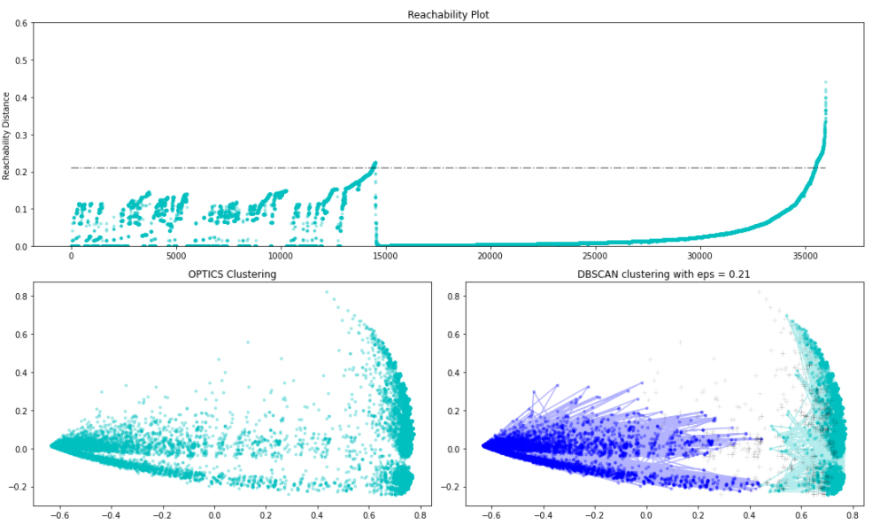

## Eyes on the Road! Uncovering Patterns in California’s Traffic Collisions using Advanced Data Mining​

[Ethan Robert Casin](https://ph.linkedin.com/in/ethancasin), 
[Jason Dolorso](https://www.linkedin.com/in/jasondolorso/),
[Cymon Marcaida](https://www.linkedin.com/in/cymonmarcaida/),  
Asian Institute of Management

### Executive Summary

Driving has been part of our daily lives. It is one of the major ways in transporting a place to another, along with commuting. But as the number of cars on the road increase and the number of drivers rise, so is the traffic-related injuries and deaths. According to CDC, 1.35 million people are killed on the roadways annually around the world. Traffic collisions are also the eight-leading cause of death and now more people die in crashes than HIV or AIDS. Low-income countries, like the Philippines, also suffer three times the death rate as compared to higher income countries.

Thorough data of all traffic collisions are not easy to come by — more so geotagged data.

But the State of California, in partnership with the Safe Transportation Research and Education Center of UC Berkeley, started a project since 2003 to create Statewide Integrated Traffic Records System (SWITRS). It is one of the most comprehensive transportation safety data available which contains geo-coded crash data where the data collection is handled by the California Highway Patrol (CHP).

The database of SWITRS will be the data to be utilized in this study.

---

*Full text article and source codes can be provided upon request*.

